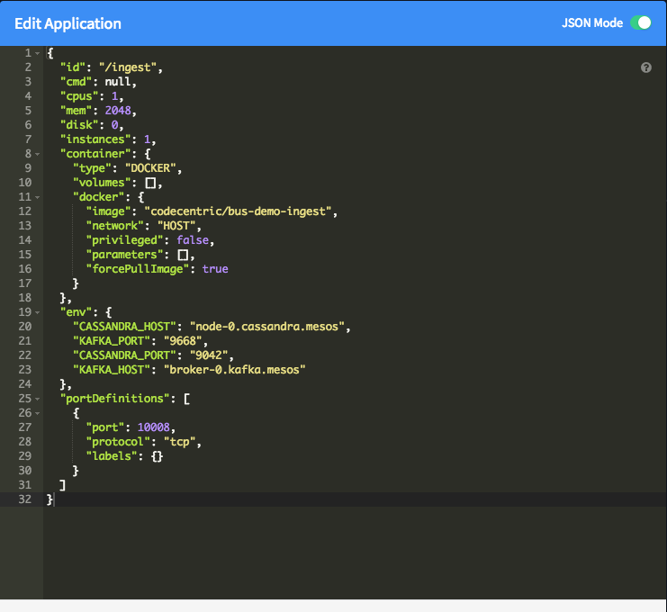
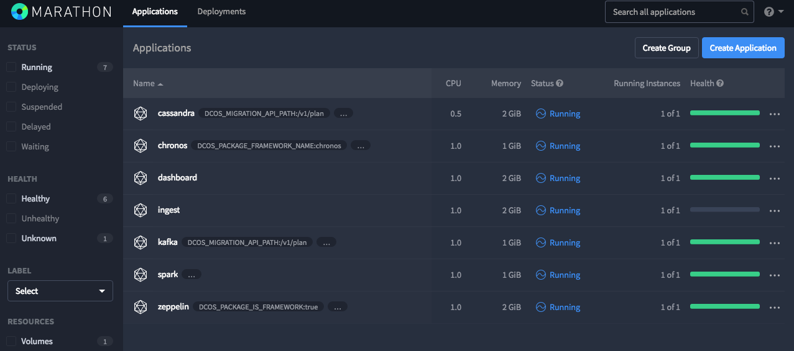
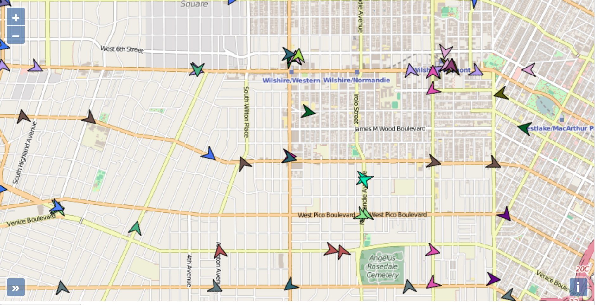

#Iot Fast Data analytics

or how to run the SMACK stack on DC/OS with a stream of data.  
Details about this showcase can be found in the following blog posts: 
 
 - [Iot Analytics Platform](https://blog.codecentric.de/en/2016/07/iot-analytics-platform/)
 - [SMACK Stack - DC/OS Style](https://blog.codecentric.de/en/2016/08/smack-stack-dcos-style/)

In short, with this showcase you'll receive live data from the Los Angeles METRO API. 
The data is streamed to Apache Kafka and consumed by Apache Spark and an Akka application. 
 
**Table of Contents**

- [Architecture](#architecture)
- [Prerequisites](#prerequisites)
- [Install](#install) the demo
- [Use](#use) the demo
 
## Architecture
This is just an excerpt of details to be found in the following blog [Iot Analytics Platform](https://blog.codecentric.de/en/2016/07/iot-analytics-platform/)
The architecture splits into the following parts: 
- Ingest – Akka
- Digest – Spark
- Backend – Akka
- UI – Javascript, Openstreetmap


The **ingestion** retrieves the data from an REST endpoint at the Los Angeles METRO API, and streams this
data into the Kafka. From there the data is **digested** by a Spark streaming job, and stored in a Cassandra NoSQL database. 
This data which has been transformed for Cassandra (see blog post for the why), is now send back again to Kafka
and consumed by an Akka backendsystem. The UI Uses either REST or Websockets to retrieve the data from Cassandra
or Kafka via the Akka backendsystem. 

## Prerequisites

- A running [DC/OS 1.8.8](https://dcos.io/releases/1.8.8/) or higher cluster with at least 4 private agents and 1 public agent each with 2 CPUs and 5 GB of RAM available as well as the [DC/OS CLI](https://dcos.io/docs/1.8/usage/cli/install/) installed in version 0.14 or higher.
- The JSON query util [jq](https://github.com/stedolan/jq/wiki/Installation) must be installed.
- [SSH](https://dcos.io/docs/1.8/administration/access-node/sshcluster/) cluster access must be set up.
- The [dcos/demo](https://github.com/dcos/demos/) Git repo must be available locally, use: `git clone https://github.com/dcos/demos.git` if you haven't done so, yet.

## Install

### Spark

Install the Apache Spark package at least with version **1.0.2-2.0.0**, it needs to be a Spark 2.0 version though. 

```bash
dcos package install spark
```

### Cassandra

Install version **1.0.16-3.0.8** of Apache Cassandra, or better from the universe.  

```bash
dcos package install cassandra
```

Make sure the cassandra is fully functional check it with the dcos cassandra command: 

```bash
dcos cassandra connection
```

The setup of the required cassandra schema is done via an [Jobs](https://docs.mesosphere.com/1.8/usage/jobs/getting-started/) job. 
With the jobs frontend you're able to use the following configuration. 

```json
{
  "id": "init-cassandra-schema-job",
  "description": "Initialize cassandra database",
  "run": {
    "cmd": "/opt/bus-demo/import_data.sh node-0.cassandra.mesos",
    "cpus": 0.1,
    "mem": 256,
    "disk": 0,
    "docker": {
      "image": "codecentric/bus-demo-schema:3.0.7"
    }
  }
}
```

Another way of installing is by using the dcos cli. 
For this use the [cassandra-schema.json](configuration/cassandra-schema.json) file.
 
Issue the following command line: 
```bash
dcos job add configuration/cassandra-schema.json
dcos job run init-cassandra-schema-job
```

This will start a job, which initializes the configured cassandra. 

### Kafka

Install version **1.1.9-0.10.0.0** of Apache Kafka, no extra requirements needed for Kafka. 

```bash
dcos package install kafka
```

### Ingestion

Now that the basic SMACK infrastructure is available, let's start with the ingestion part of the setup. 
Again there are two ways of installing this application. Either with the front end, or by using the dcos cli. 

Using the frontend 



```json
{
  "id": "/bus-demo/ingest",
  "cpus": 0.1,
  "mem": 2048,
  "disk": 0,
  "instances": 1,
  "container": {
    "type": "DOCKER",
    "volumes": [],
    "docker": {
      "image": "anierbeck/akka-ingest:0.2.1-SNAPSHOT",
      "network": "HOST",
      "privileged": false,
      "parameters": [],
      "forcePullImage": true
    }
  },
  "env": {
    "CASSANDRA_CONNECT": "node-0.cassandra.mesos:9042",
    "KAFKA_CONNECT": "broker.kafka.l4lb.thisdcos.directory:9092"
  }
}
```

First make sure the port and host are correct. To check for the correct host and ports issue: 

```bash
dcos kafka connection
```

you'll receive a list of hosts and ports, at this point make sure to use the **vip** connection string. 
For example: 

```
"vip": "broker.kafka.l4lb.thisdcos.directory:9092"
```
Use this connection string to connect to the kafka broker.
The same applies for the connection of the cassandra. 

```bash
dcos cassandra connection
```

For the client command use the dcos cli use the [akka-ingest.json](configuration/akka-ingest.json) file.  
And issue the following commands: 

```bash
dcos marathon app add configuration/akka-ingest.json
```

### Spark Jobs

The digestional part of the application is done via Spark jobs. To run those jobs you'll need to use the
dcos cli.   

```bash
dcos spark run --submit-args='--driver-cores 0.1 --driver-memory 1024M --total-executor-cores 4 --class de.nierbeck.floating.data.stream.spark.KafkaToCassandraSparkApp https://oss.sonatype.org/content/repositories/snapshots/de/nierbeck/floating/data/spark-digest_2.11/0.2.1-SNAPSHOT/spark-digest_2.11-0.2.1-SNAPSHOT-assembly.jar METRO-Vehicles node-0.cassandra.mesos:9042 broker-0.kafka.mesos:9092'
```

again here make sure you have the proper connection string for Kafka and Cassandra. 

```bash
dcos kafka connection | jq .vip | sed -r 's/[\"]+//g'
```
will produce a connection with host and port like the following: _broker.kafka.l4lb.thisdcos.directory:9092_

The same has to be applied for cassandra: 
```bash
dcos cassandra connection | jq .vip | sed -r 's/[\"]+//g'
```

### Dashboard Application

The dasboard application will take care of the front end and the communication with Cassandra and Kafka. 

Either install it via the DC/OS UI by creating a new marathon app: 

```json
{
  "id": "/bus-demo/dashboard",
  "container": {
    "type": "DOCKER",
    "docker": {
      "image": "anierbeck/akka-server:0.2.1-SNAPSHOT",
      "network": "HOST",
      "forcePullImage": true
    }
  },
  "acceptedResourceRoles": [
    "slave_public"
  ],
  "env": {
      "CASSANDRA_CONNECT": "node-0.cassandra.mesos:9042",
      "KAFKA_CONNECT": "broker.kafka.l4lb.thisdcos.directory:9092"
  },
  "upgradeStrategy": {
    "minimumHealthCapacity": 0
  },
  "dependencies": ["/bus-demo/ingest"],
  "healthChecks": [
    {
      "path": "/",
      "protocol": "HTTP",
      "gracePeriodSeconds": 300,
      "intervalSeconds": 60,
      "timeoutSeconds": 20,
      "maxConsecutiveFailures": 3,
      "ignoreHttp1xx": false,
      "port": 8000
    }
  ],
  "cpus": 0.1,
  "mem": 2048.0,
  "ports": [
    8000, 8001
  ],
  "requirePorts" : true
}
```

or by using the dcos cli and the [dashboard.json](configuration/dashboard.json) file. 

```bash
dcos marathon app add configuration/dashboard.json
```

so after that you should have a nice list of applications: 



## Use

Now that we successfully installed the application, let's take a look at the dashboard application.
For this we just need to navigate to the `http://$PUBLIC_AGENT_IP:8000/`.
Details about finding out how to find your public agent's ip can be found in the [documentation](https://dcos.io/docs/1.9/administration/locate-public-agent/).  
The application will give you a
map where with every poll of the bus-data, that data is streamed into the map via a websocket connection. 



Besides the real-time data streamed into the map, it's possible to request the data from the last 15 Minutes, 
taken from the cassandra. 
 
At this point may I point you again to the full blog about what can be done with this use-case at
 [Iot Analytics Platform](https://blog.codecentric.de/en/2016/07/iot-analytics-platform/). It will give you 
 much better details about why the incoming x,y position data is combined to be in a quadkey. 
 
You also can find some more details about the second use-case on with this showcase. How to use a 
“Density-Based Clustering in Spatial Databases” (DBSCAN) grouping algorithm to find clusters of Busses, and
 to actually compute where there are major bus-stops. 
 